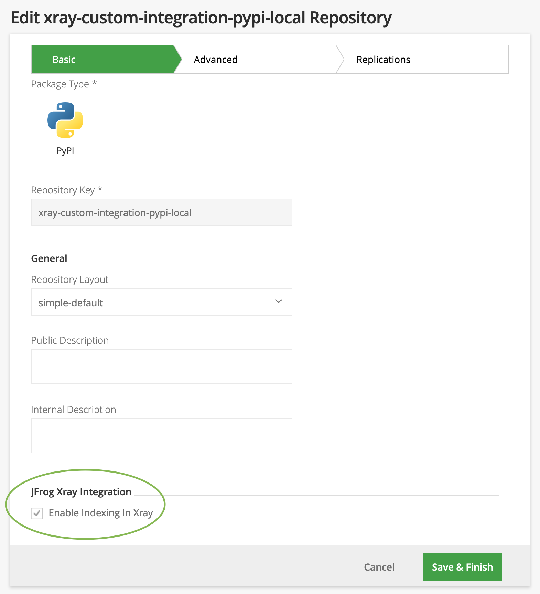
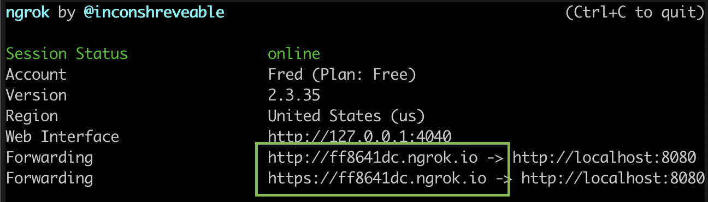
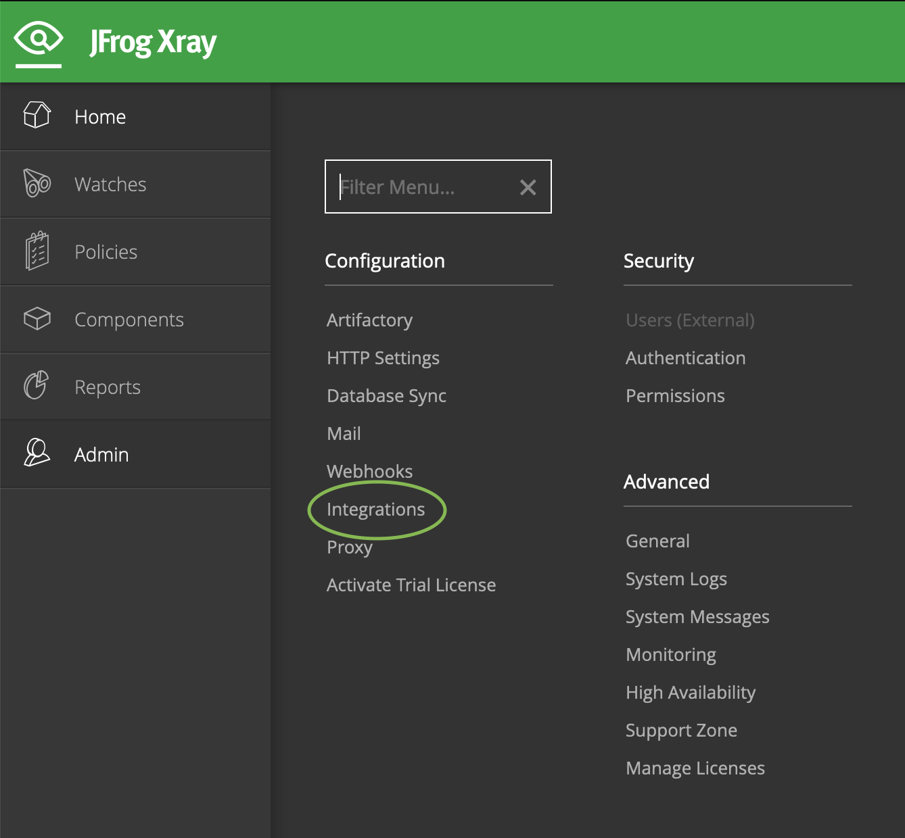
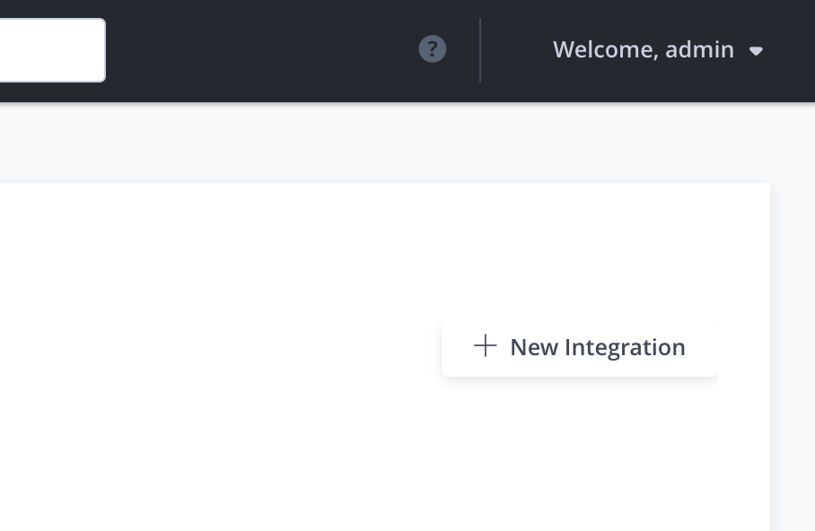
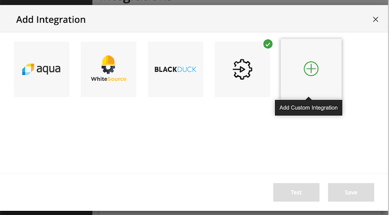
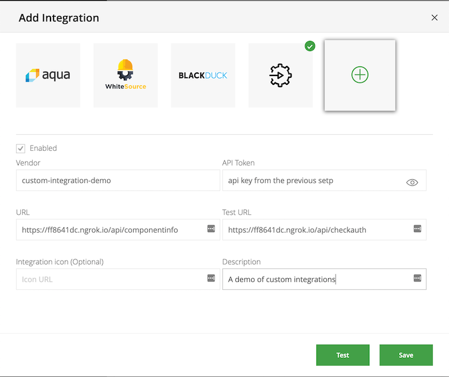
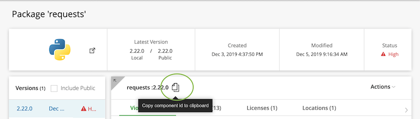

XRay Custom Integration Demo
=====

## What is a custom integration?

XRay can integrate with external services that provide information about vulnerabilities in packages. If a user wants to implement their own such service they can use a custom integration.


## Creating a custom Integration

There are three pieces to set up:

- Artifactory
- Your custom integration server
- XRay

### Artifactory Setup

Update the settings for a repository in Artifactory to be viewable by XRay.



### Running the included demo server

`go run main.go (<api-key>) [<path-to-db-file>]`

If a path to db file is not specified, [db.json](./db.json) will be used. Take note of the api key for the next step.

### Using ngrok to expose your server to the internet

The demo server runs on port 8080, so that's the port to expose.

`ngrok http 8080`

Once ngrok is running, take note of the forwarding urls. These will be provided to XRay when configuring the integration.



### XRay Setup

Open the integrations view from the admin panel in the sidebar.



Click the + icon to add an integration.



Select custom integration.



Configure the integration.

- The base url will be unique to you (e.g. `https://eq8341dc.ngrok.io`).

- Use `/api/componentinfo` and `/api/checkauth` as the endpoint names.

-  Use `custom-integration-demo` as the Vendor.



Test the connection and api key by clicking the "Test" button. You should get a message saying "API key is valid" in the XRay UI.

### Generating a Security Vulnerability

On the details page of the component you want to test, copy the **component id**.



[Depending on the package type](https://www.jfrog.com/confluence/display/XRAY/Xray+REST+API#XrayRESTAPI-ComponentIdentifiers), the component's id should look something like `pypi://requests:2.22.0`. 

At the bottom of [db.json](./db.json), create a new database entry with a fake vulnerability for your package.

In the `component_id` field, **do not include the version**. Semver ranges are supported by the demo server.

```
  {
    "component_id": <component-id-without-version>,
    "licenses": [
      {
        "version": <component-version>,
        "licenses": [
          "Apache 2.0"
        ]
      }
    ],
    "vulnerabilities": [
      {
        "cve": "CVE-0000-0000",
        "version": <component-version>,
        "type": "security",
        "source_id": "0",
        "summary": "A fake vulnerability with my component",
        "description": "A description of the fake vulnerability",
        "cvss_v2": "7.9",
        "url": "http://more.info",
        "publish_date": "2019-11-03T07:30:51.991+00:00",
        "references": [
          "https://example.com"
        ]
      }
    ]
  }

```

For a component with and id of `pypi://requests:2.22.0`, the entry might look like this:

Note that this example uses a semver range for its licence version
```
  {
    "component_id": "pypi://requests",
    "licenses": [
      {
        "version": "^2.0.0",
        "licenses": [
          "Apache 2.0"
        ]
      }
    ],
    "vulnerabilities": [
      {
        "cve": "CVE-0000-0000",
        "version": "2.22.0",
        ...
      }
    ]
  }
```

In XRay, manually trigger a scan for the component.


After a few seconds, a new security violation should be viewable in the Security tab.

### Testing a component without any vulnerability

Using a new component, make another db entry without any elements in the "vulnerabilities" array.

```
  {
    "component_id": <component-id-without-version>,
    "licenses": [
      {
        "version": <component-version>,
        "licenses": [
          "Apache 2.0"
        ]
      }
    ],
    "vulnerabilities": []
  }


```

Trigger a scan for violations. No new security violations should appear in the UI. A new license should appear in the licenses tab after the first time the scan runs.

### Watching for vulnerabilities

In XRay, it is possible to create **policies** about vulnerabilities that can impose restrictions on an artifact (e.g. blocking the download of an artifact with a sufficiently severe security vulnerability). XRay **watches** can watch repositories for violation of policies and changes to licenses.

To try this out with the demo, [create a watch and a policy](https://www.jfrog.com/confluence/display/XRAY/Watches) and add a new package to one of the repos being watched. If you add a package that matches one of the vulnerabilities in the database, the watch should trigger the creation of a new vulnerability listing for that component.

### Running Tests

`go test ./`