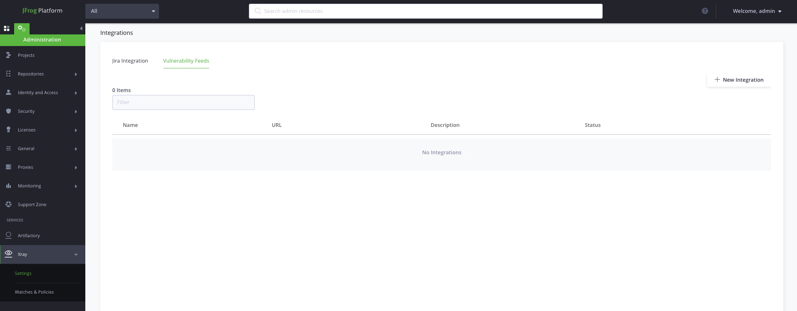

XRay Custom Integration Demo
=====

### What is a custom integration?

XRay can integrate with external services that provide information about vulnerabilities in packages. If a user wants to implement their own such service they can use a custom integration.

### Artifactory Setup

Update the settings for a repository in Artifactory to be viewable by XRay.

### Running the included demo server

`go run main.go (<api-key>) [<path-to-db-file>]`

If a path to db file is not specified, [db.json](./db.json) will be used. Take note of the api key for the next step.

### Using ngrok to expose your server to the internet

The server runs on port 8080, so that's the port to expose.

`ngrok http 8080`

Once ngrok is running, take note of the forwarding urls. These will be provided to XRay when configuring the integration.

### XRay Setup

Open the integrations view from the admin panel in the sidebar.

Click the + icon to add an integration.

Select custom integration.

Configure the integration.

- The base url will be unique to you (e.g. `https://eq8341dc.ngrok.io`).

- Use `/api/componentinfo` and `/api/checkauth` as the endpoont names.

-  Use `custom-integration-demo` as the Vendor.

  

Test the connection and api key by clicking the "Test" button. You should get a message saying "API key is valid" in the XRay UI.

### Running Tests

`go test ./`